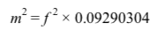

## 07.矩形房间的面积

编写一个计算房间面积的程序。提示用户输入以英尺为单位的房间的长和宽。然后显示以平方英尺

和平方米为单位的面积。

## 示例输出
What is the length of the room in feet? 15 
What is the width of the room in feet? 20 

You entered dimensions of 15 feet by 20 feet.

The area is 

300 square feet

27.871 square meters

​		
​		
计算公式：		
​					

​		

## 约束
- 让计算与输出分离。
- 使用一个常量来保存转换因子。

## 挑战
- 修改程序，确保输入的是数值。如果不是，不允许继续。
- 开发一个新版本，支持用户选择输入的单位是英尺还是米。
- 以GUI方式来实现该程序，当任何一个值有修改时，自动更新结果。
