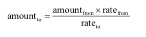

## 11.货币兑换

编写一个货币兑换程序。具体来说，是将欧元兑换成美元。
提示输入手动的欧元数，以及欧元的当前汇率。打印可以兑换的美元数。
货币兑换的公式为：

其中
- amountto 是美元
- amountfrom 是欧元数
- ratefrom 是欧元的当前汇率
- rateto 是美元的当前汇率

  ​

## 示例输出

How mang euros are you exchanging? 81
What is the exchange rate? 137.51
81 euros at an exchange rate of 137.51 is
111.38 U.S. dollars.

## 约束

- 注意小数部分，不足1美分的向上取整。
- 使用单条输出语句。

## 挑战

- 构建一个汇率字典，提示用户输入国家而不是汇率。
- 将应用连接到一个提供当前汇率的外部API。

